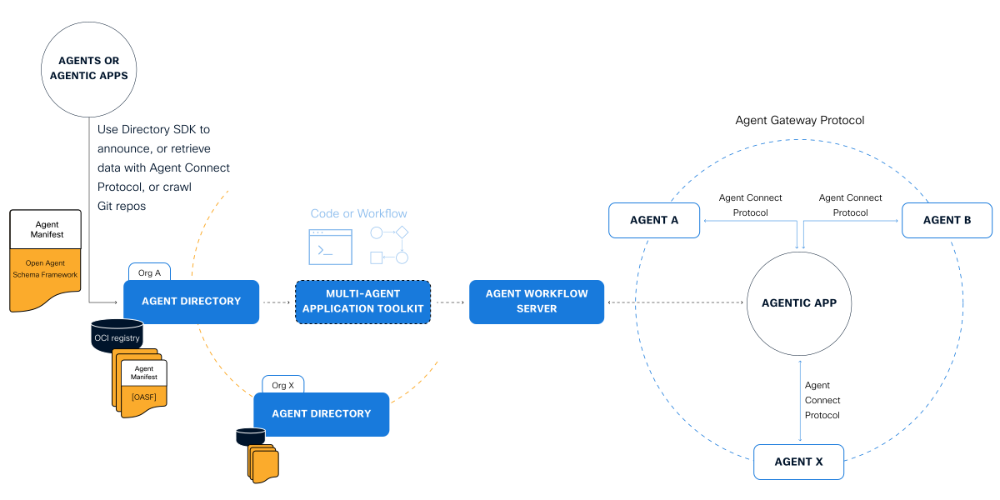

# The AGNTCY Charter & Operating Model

## 1. Project Overview

### 1.1 Name & Identity

- **Collective**: **The** **AGNTCY (aka Internet of Agents Collective, or the Collective)**
- **Identity**: The AGNTCY (pronounced "agency") is the collective of contributors and maintainers building the Internet of Agents (IoA): an open, interoperable, internet for agent-to-agent collaboration.

### 1.2 Mission & Vision

- **Mission**: Provide a collaborative environment where contributors of all backgrounds can innovate, develop, and maintain software components that solve key problems in the domain of agentic workflows and multi agent application creation: agent identity, agent announcement, agent discovery and search, agent connectivity, agent to agent collaboration, agentic ensembles deployment, supervision, observability, security and more. Simply put, we intend to build the Internet of Agents, *together*.

*Figure 1: The Internet of Agents simplified architecture*

- **Vision**: We envision a future where Agentic AI systems transform industries by enabling the developer community, partners, and enterprises to build intelligent, autonomous AI applications. This new AI-native world needs a communication layer, *the Internet of Agents*, to enable collaboration across the ecosystem of agentic applications of various kinds, from different vendors, across different industries.
    - Agentic software will accelerate all of human work – cognitive, services, and physical. Enterprises will need to create deterministic workflows or planner-based jobs and applications, combining internal and third-party agents, to fully leverage the power of AI to accelerate their business and unlock new step-change in productivity.
    - An open, neutral and interoperable Internet of Agents drives maximum value for all players: infrastructure and tool builders, operators, app developers, and consumers. It avoids vendor lock-in.

---

## 2. Charter

### 2.1 Purpose

The AGNTCY intends to serve the IoA ecosystem in the foundation-like role of open source software steward.

- **Open Collaboration**: Foster a globally accessible community that encourages contributions from individuals and organizations.
- **Innovation**: Empower contributors to experiment, propose, and build new features through open discussion and consensus.
- **Stewardship of the projects**: Give each contributor a voice in shaping the proposed initiatives, relevant open-source projects, and overall direction of The AGNTCY.
- **Fostering the growth and evolution of the ecosystem**: Provide community development and education around the collective's affiliated projects. This includes reviewing or contributing documentation, workshops, demos, and tutorials to onboard new users and contributors. Serve the community by making the IoA technologies accessible and reliable.

### 2.3 Guiding Principles

#### 1. Trust & Transparency

- We guide projects to build trust with adopters and users, balancing quality and sustainability with velocity.
- Our technical work must be available to all according to these guiding principles. Our community, processes, and decisions are transparent, visible, and discoverable.

#### 2. Open & Extensible

- We are open to and inclusive of all adopters and collaborators to build a collective of different perspectives that can help create a powerful global standard.
- We invite proactive contributions from our community of developers to extend or adopt AGNTCY for all agentic applications beyond its existing capabilities.

#### 3. Platform Agnostic

- We have an explicit bias toward projects and specifications developed to be platform agnostic such that they can be implemented on a variety of platforms, architectures, clouds, and operating systems.

#### 4. Modularity & Interoperability

- Encourage a modular architecture to facilitate incremental improvements and smooth interoperability with external tools.

#### 5. Meritocracy & Inclusivity

- Contributions are valued based on quality and impact, independent of personal background.
- Strive to maintain an inclusive environment where diverse perspectives are respected.

#### 6. Respect & Professionalism

- Uphold a Code of Conduct that ensures respectful communication, constructive feedback, and zero tolerance for harassment.

---

## 3. Roles and Governance

### 3.1 Definition of Roles

This section outlines the various responsibilities of roles in AGNTCY. 

| **Role**           | **Responsibilities**                                                 | **Requirements**                                                                                                                  | **Defined By**                                                                                                                  |
| ------------------ | -------------------------------------------------------------------- | --------------------------------------------------------------------------------------------------------------------------------- | ------------------------------------------------------------------------------------------------------------------------------- |
| Adopter            | For those using and/or evangelizing AGNTCY in their organization     | Your company name in the AGNTCY adopter list on GitHub. The Collective gains momentum and credibility with your company’s support | Companies that support AGNTCY through use of affiliated projects and shared belief in an open, interoperable internet of agents |
| Contributor        | Active contributor in the community, reviewer of PRs                 | Evidence of multiple contributions to AGNTCY projects                                                                             | Members of GitHub organization                                                                                                  |
| Maintainer         | Code review and approvals, help set project direction and priorities | Highly experienced active contributor, author, and reviewer of a project                                                          | [CODEOWNERS](https://help.github.com/en/articles/about-code-owners) in GitHub, GitHub Team                                      |
| Steering Committee | Governance of projects jointly owned under the Collective            | Core maintainer-based membership                                                                                                  | Noted in org-level README, GitHub Team                                                                                          |

### 3.2 Adopters

- People or organizations that use and/or evangelize AGNTCY affiliated projects but may or may not directly contribute to its projects.
- **Participation**:
    1. Share feedback and report bugs.
    2. Share case studies for evangelizing the Collective.
    3. Participate in user forums, Q&A channels, or community calls.

### 3.3 Contributors

- Individuals who contribute code, documentation, designs, bug fixes, or community support for The AGNTCY affiliated projects. Reviewing contributions is also considered active participation as a contributor.
- **Path to Contribution**:
    1. Submit pull requests or patches.
    2. Engage in discussions, design proposals, and issue triage.
    3. Agree to abide by the Code of Conduct and licensing guidelines.
    4. Be nominated by two (2) or more maintainers to achieve contributor permissions.

### 3.4 Maintainers

- Individuals who review and/or approve contributed code, documentation, designs, bug fixes, or moderate community support for The AGNTCY affiliated projects.
- **Path to Maintainer**:
    1. Frequently review pull requests or patches.
    2. Lead discussions, design proposals, and issue triage.
    3. Be nominated by the AGNTCY Steering Committee to achieve maintainer permissions.

### 3.5 **Steering Committee**

The AGNTCY Steering Committee is responsible for the governance of projects jointly owned under the Collective. The Steering Committee will also make technical decisions for the Collective, until such a time that the growth of the Collective would require an establishment of a Technical Oversight Committee or Maintainer Council.

- **Composition**: The Steering Committee will be comprised of the initial three Core Maintainers. It is the intent to establish a voting mechanism and process to expand the Steering Committee, to be determined by contributors. The vision is for the AGNTCY to be a community-governed collective and include long-standing contributors and maintainers from the Collective's affiliated projects.
- **Responsibilities**:
    1. Oversee strategic and long-term Collective goals.
    2. Guide architectural decisions and set standards.
    3. Resolve escalated technical or governance disputes.
    4. Ensure the community adheres to the Code of Conduct and licensing standards.
    5. Approve critical changes to the Collective's recommendations for affiliate project's governance, or licensing.
    6. Direct marketing, including evangelism, events and ecosystem engagement

---

## 4. Decision-Making Process

### 4.1 Consensus Seeking

- **Proposal Discussion**: Open issues or pull requests on GitHub for discussion.
- **Review Window**: Maintain a minimum discussion period (e.g., 3--5 business days) for meaningful member feedback.
- **Approval**: If no major objections are raised, the proposal is considered accepted.
- **Escalation**: When disagreements persist, the relevant Technical Lead or Steering Committee member mediates.

### 4.2 Lazy Consensus

- For minor changes or routine updates, maintainers can merge after a brief review period if there are no objections.

### 4.3 Formal Votes

- On critical changes (e.g., major feature adoption, license amendments), the Steering Committee may call a vote.
- **Simple Majority**: Required for most issues; **Two-Thirds Majority** for fundamental changes or governance modifications.

---

## 5. Contribution Workflow

Contribution workflows can be established for each respective AGNTCY affiliate project, however, the below are recommended guidelines.

### 5.1 Source Code Management

- **Repository**: GitHub (or potentially GitLab) serves as the central code repository.
- **Branching Strategy**:
    1. **main** (stable production branch).
    2. **feature/XYZ** branches for new functionality.
    3. **release/X.Y** branches for versioned releases.

### 5.2 Issue Tracking & Labeling

- **Issue System**: GitHub Issues for bugs, enhancements, and user stories.
- **Labeling**:
    1. **good first issue**: For newcomers.
    2. **help wanted**: For issues needing broader community input.
    3. **bug**, **enhancement**, **documentation**, etc. for clarity.

### 5.3 **Pull Request Reviews**

- **Minimum Approvals**: At least one maintainer or module lead must approve. Two approvals recommended for larger features.
- **Automated CI**: Must pass all tests (unit, integration, lint) before merge.
- **Code Quality**: Follow coding standards, best practices, and style guidelines documented in CONTRIBUTING.md.

### 5.4 **Testing & Releases**

- **Continuous Integration**: Use a CI service (GitHub Actions, CircleCI, Jenkins) to automate builds and tests.
- **Release Cadence**:
    - **Monthly Minor Releases**: Include new features, improvements, and bug fixes.
    - **Quarterly Major/Minor**: Larger milestones or architectural changes.
    - **Patch Releases**: For urgent bug or security fixes.

---

## 6. Community Engagement

### 6.1 Communication Channels

The core communication will be through the AGNTCY's Slack instance which will be through invite-only access at first.

- **Real-Time Chat**: Slack (internetofagents.slack.com) for quick collaboration, Q&A, Steering Committee and member engagement / collaboration.
- **Video chat:** When necessary and as affiliate project or AGNTCY business needs evolves, members may need to join collaborative video calls via Webex, Google Hangout, Zoom, or similar.
- **Community Calls**: If needed, quarterly video calls could be held that would be open to everyone, focusing on demos, roadmap updates, and Q&A.

### 6.2 Documentation & Website

The AGNTCY’s main web home will be a Git repo that all members have access to. The vanity URL and domain of "[AGNTCY.org](https://AGNTCY.org)" will have relevant collective information. Some items that may be included there:

- **User Guide**: Detailed setup instructions, examples, and best practices.
- **Developer Guide**: Architecture overview, how to run tests, coding conventions, how to propose changes.
- **FAQ**: Common usage issues, frequently asked questions, and troubleshooting steps.

### 6.3 Events & Outreach

The AGNTCY by definition is a community-oriented organization. To achieve our mission, we must build and collaborate together! We intend to support member initiatives through investing in and coordinating in person and virtual meetups as well as educational initiatives. These could include the following:

- **Meetups/Workshops**: Encourage local community gatherings and virtual hackathons.
- **Conferences**: Represent AGNTCY at open source conferences, featuring project updates, case studies, or success stories.
- **Social Media & Blog**: Publish release notes, tutorials, and highlight community contributions.

### 6.4 Mentorship & Onboarding

- **Onboarding Guides**: Step-by-step tutorials for new contributors.
- **Mentorship**: Pair newcomers with experienced maintainers for support.
- **Beginner Tasks**: Curate "good first issue" tasks to help new contributors gain confidence.

---

## 7. Code of Conduct & Conflict Resolution

### 7.1 Code of Conduct

- Adopts the [**Contributor Covenant**](https://www.contributor-covenant.org/) (version 2.1 or newer), ensuring a welcoming and respectful community.

### 7.2 Reporting & Enforcement

- **Incident Reporting**: Private email alias (e.g., conduct@agntcy.org) for confidentially reporting issues.
- **Investigation**: A designated member or group of the Steering Committee will review reports promptly, ensuring fairness and discretion.
- **Consequences**: Range from warnings to temporary or permanent bans based on severity.

### 7.3 Conflict Resolution

- **Informal Resolution**: Encourage direct, constructive dialogue for small disagreements.
- **Escalation**: If unresolved, present the issue to a Steering Committee member.
- **Final Decision**: The Steering Committee can serve as the last resort for major disputes.

---

## 8.Licensing

### 8.1 Open Source License

- **Chosen License**: Recommend collective projects adopt [Apache License 2.0](https://www.apache.org/licenses/LICENSE-2.0). This license promotes collaboration by providing clear patent protections and permissive usage rights.

### 8.2 Contributor Agreements

- **Developer Certificate of Origin (DCO)**: Contributors must sign off commits to confirm they are authorized to contribute.
- Alternatively, the community may adopt a **Contributor License Agreement (CLA)** if needed for legal clarity.

---

## 9. Implementation & Roadmap

### 9.1 Initial Setup

1. **Finalize Documentation**: Ensure README.md, CONTRIBUTING.md, SECURITY.md, and CODE_OF_CONDUCT.md are in place.
2. **Establish Repositories**: Configure main code repo and supporting repos (e.g., docs, website).
3. **Configure CI/CD**: Automated tests, linting, and build pipelines.

### 9.2 Short-Term Roadmap (First 3-6 Months)

- **Core Features**: Implement essential functions of the AGNTCY platform.
- **Onboarding Material**: Expand documentation and "good first issues."
- **Community Growth**: Host an inaugural community call, set up Slack/Discord, and encourage discussion on the forum.

### 9.3 Long-Term Goals

- **Feature Maturity**: Achieve stable releases, expand integrations, focus on performance and security.
- **Ecosystem Development**: Encourage third-party extensions, plug-in development, and specialized modules.
- **Community Expansion**: Local user groups, speaking engagements at conferences, and official meetups.

---

## 10. Success Metrics

### Community Growth

- Number of active affiliate projects that have active contributors, diversity of participation, and new maintainers added.

### Project Health

- Time to First Response and [Contributor Access Factor](https://chaoss.community/kb/metrics-model-starter-project-health/).
- Number of stable releases per quarter and bug fix turnaround.

### Adoption & Usage

- Downloads, GitHub stars/forks, documented user case studies.
- External references and third-party integrations.

### Governance Effectiveness

- Time to decision on major proposals, conflict resolution speed, and community sentiment.

---

## Conclusion

This charter and operating model outlines how **The AGNTCY** will operate as a transparent, inclusive, and merit-based open source collective. By combining clear governance structures, open contribution pathways, a strong code of conduct, and robust technical processes, The AGNTCY aims to foster a thriving ecosystem and deliver high-quality software solutions through its members.

**Welcome to The AGNTCY!** We look forward to building the future of multi agent applications and workflows together.
